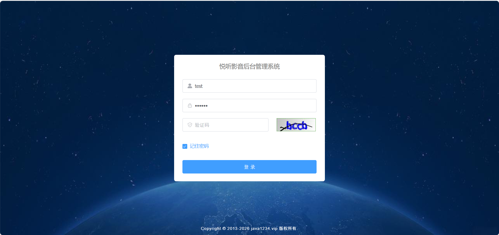
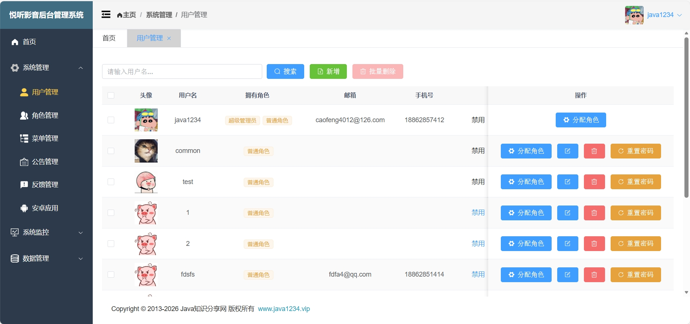
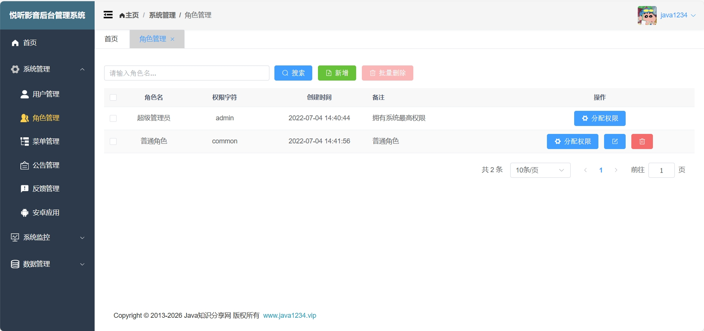
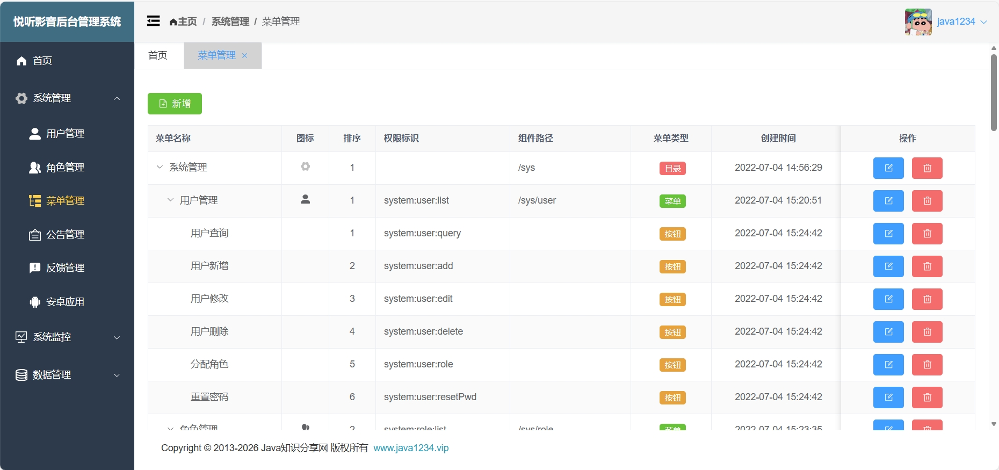
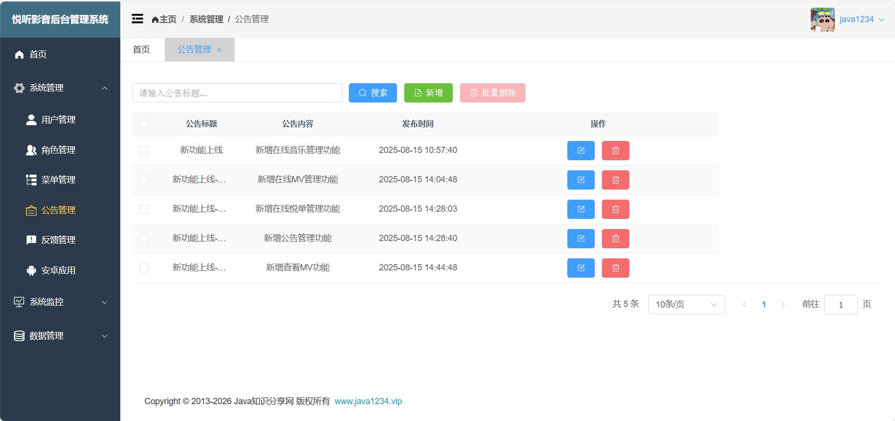
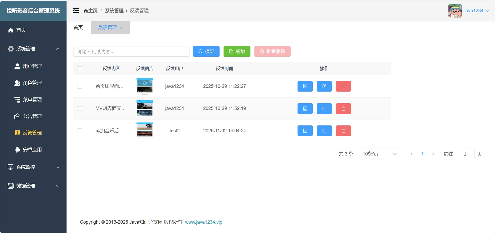
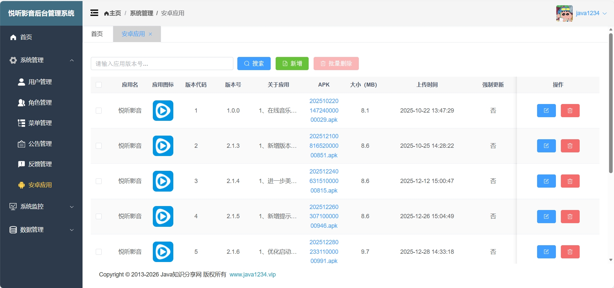
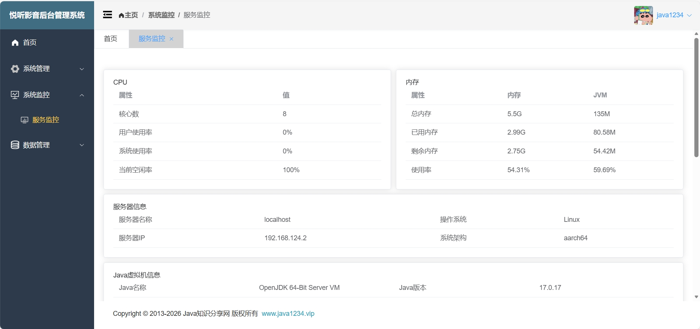
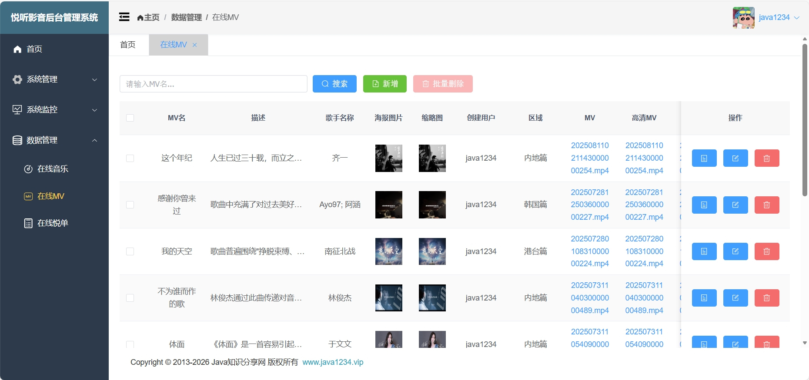
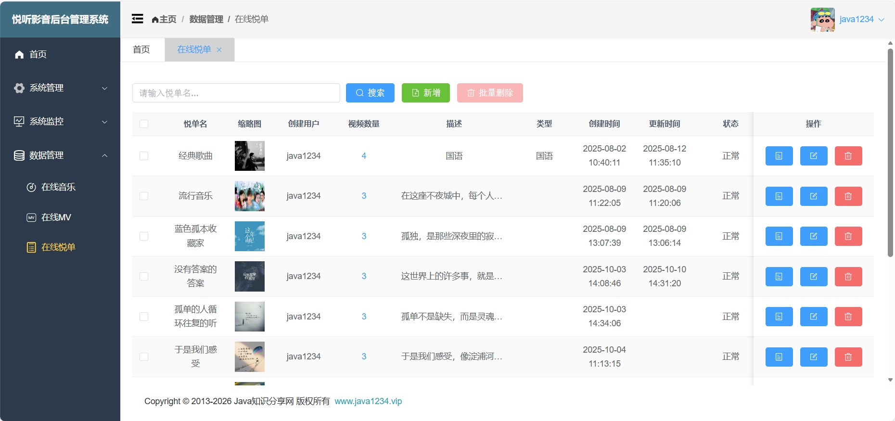

# 悦听影音后台管理系统前端界面

## 简介
这是一款基于Vue框架开源的软件，具备用户、角色、菜单、公告、反馈、安卓应用、音乐、MV和音乐清单管理、服务监控等功能。本项目基础架构来源于[**Java知识分享网**](www.java1234.vip)，资源文件来源于互联网，本软件主要作为学习和交流使用。

## 在线体验
- test2/123456

演示地址：http://hk.frpee.top:17116/

## 图片展示
<table>
    <tr>
        <td></td>
        <td></td>
    </tr>
    <tr>
        <td></td>
        <td></td>
    </tr>
    <tr>
        <td></td>
        <td></td>
    </tr>
    <tr>
        <td></td>
        <td></td>
    </tr>
    <tr>
        <td></td>
        <td></td>
    </tr>
    <tr>
        <td></td>
        <td></td>
    </tr>
    <tr>
        <td></td>
        <td></td>
    </tr>
</table>

## 运行说明
项目启动命令：npm run serve
项目打包命令：npm run build
项目打包说明：项目打包好后会在该项目下生成一个 dist 目录，将该目录下的所有文件复制到**悦听影音后台管理系统后端**（[**github**](https://github.com/LMINediva/MelodiousPlayerServer) | [**gitee**](https://gitee.com/lminediva/MelodiousPlayerServer)）的src\main\resources\static目录下，然后一起打包成jar包。如需部署至个人服务器并遇到跨域问题，请修改src\util\request.js文件中baseUrl变量的IP和端口号为您个人服务器的IP/域名和端口号。