# Front-end interface of the melodious player backend management system
[中文](README.md)

## Introduction
This is an open-source software based on the Vue framework, which has functions such as user, role, menu, announcement, feedback, Android application, music, MV and music list management, service monitoring, etc. The infrastructure of this project is sourced from [**java knowledge sharing network**](https://www.java1234.com)The resource file comes from the Internet. This software is mainly used for learning and communication.

## Online experience
- Administrator: java1234/234567
- user: test2/23456

Demo URL: http://hk.frpee.top:17116

## Image display
<table>
    <tr>
        <td>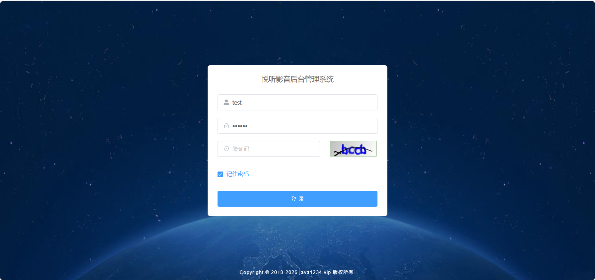</td>
        <td>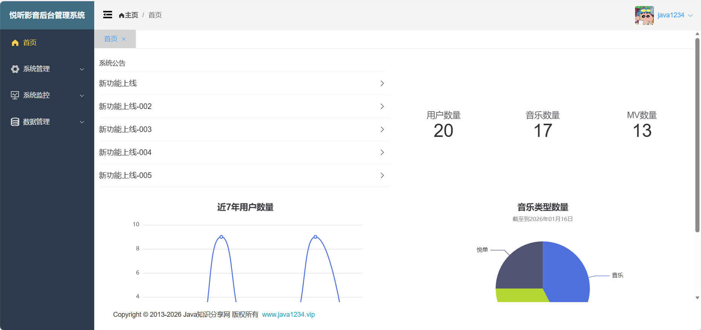</td>
    </tr>
    <tr>
        <td>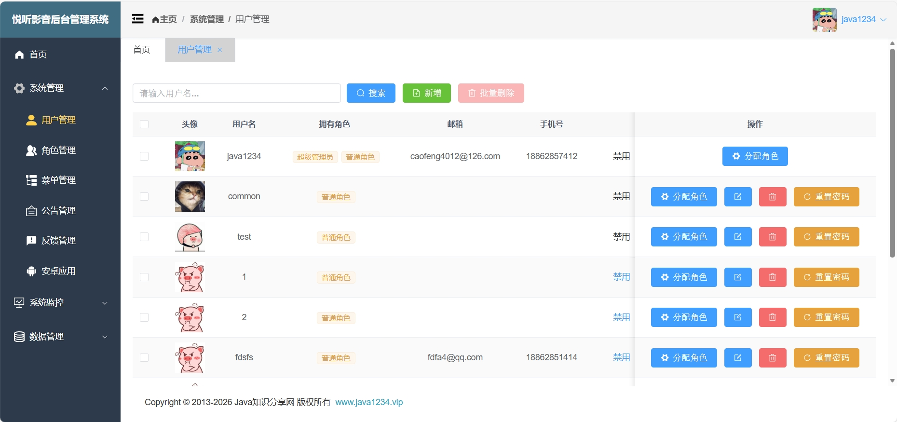</td>
        <td>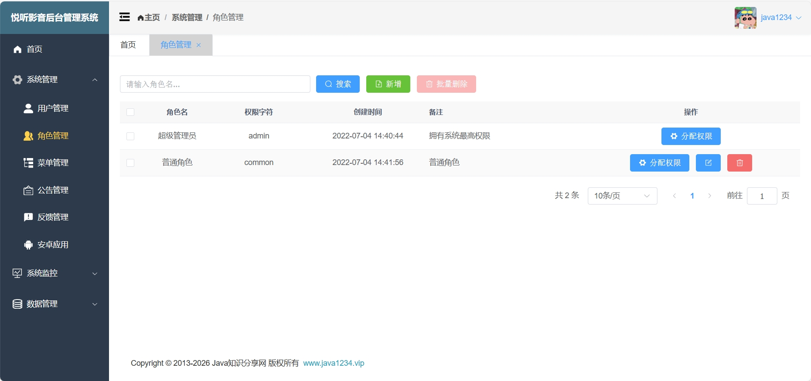</td>
    </tr>
    <tr>
        <td>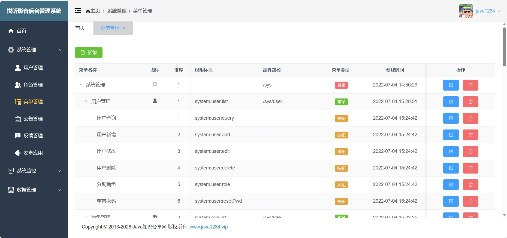</td>
        <td>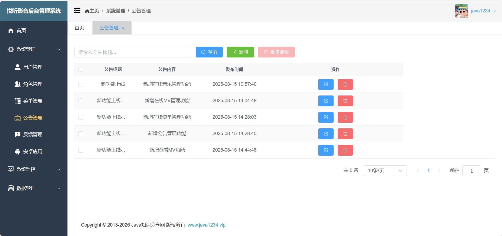</td>
    </tr>
    <tr>
        <td>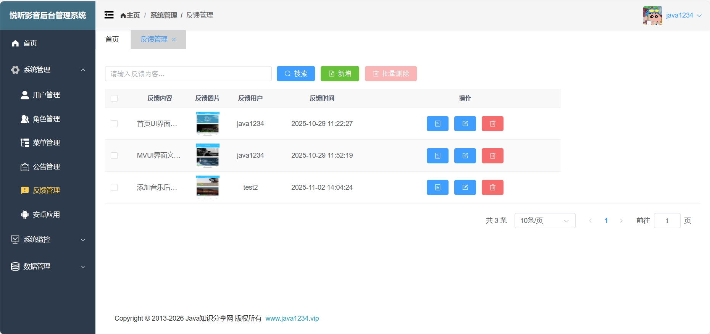</td>
        <td>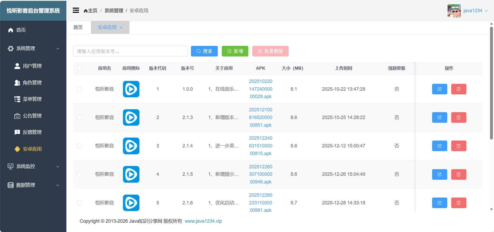</td>
    </tr>
    <tr>
        <td>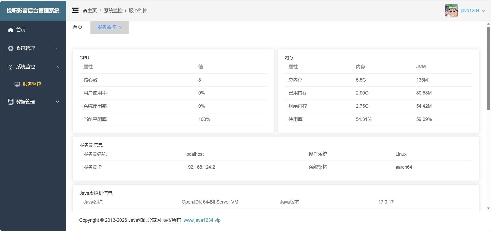</td>
        <td>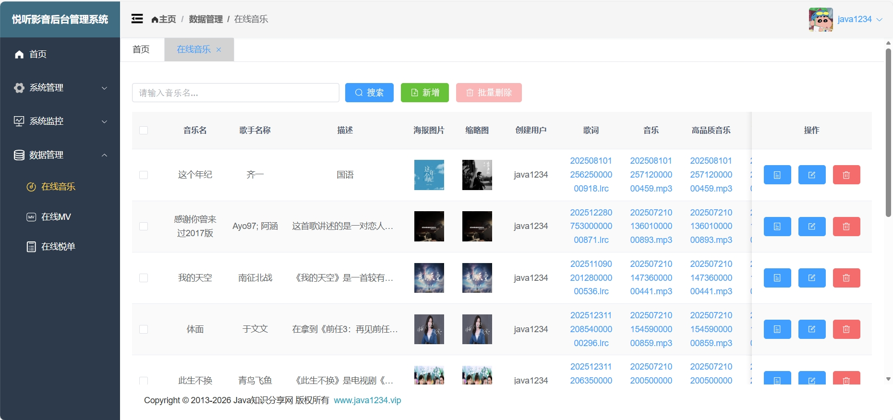</td>
    </tr>
    <tr>
        <td>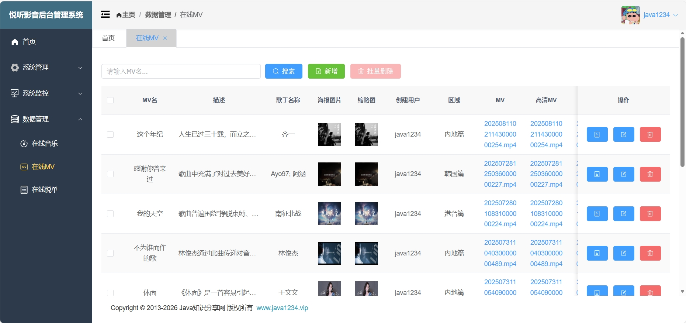</td>
        <td>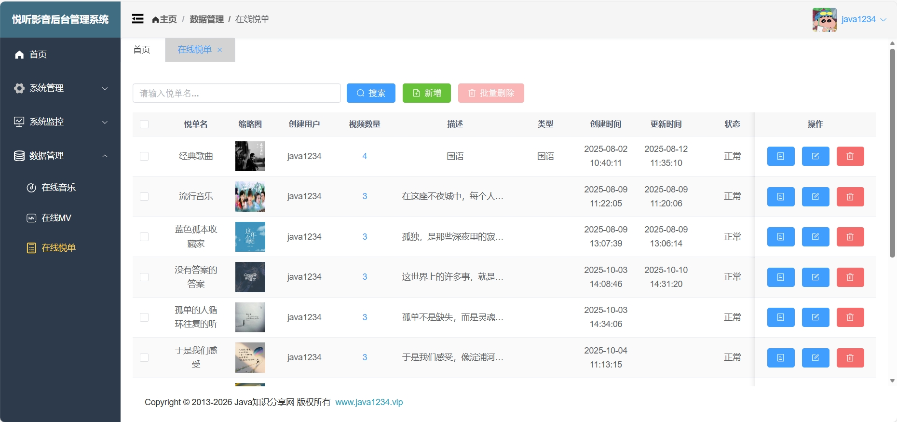</td>
    </tr>
    <tr>
        <td>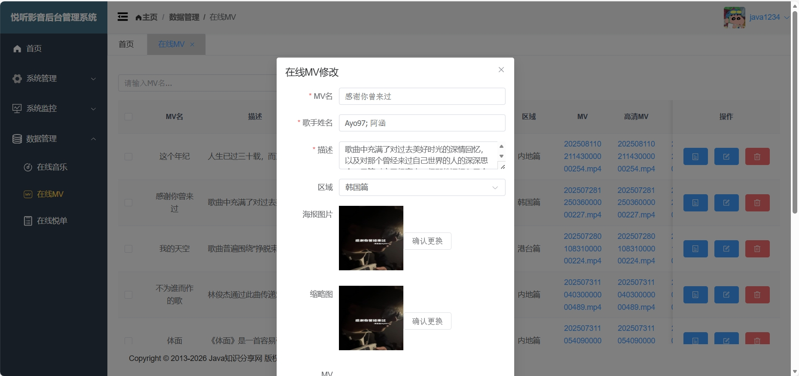</td>
        <td>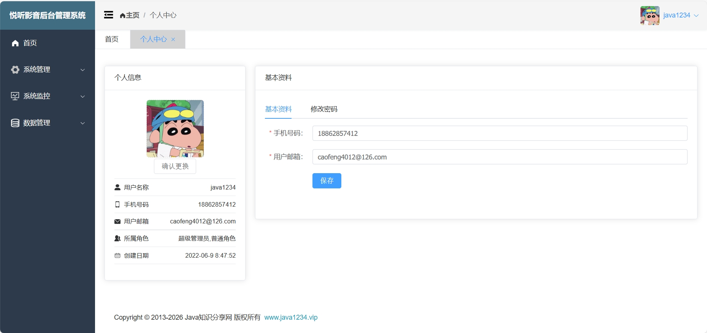</td>
    </tr>
</table>

## Operating instructions
Project initiation command: npm run serve
Project packaging command: npm run build
Project Packaging Instructions: after the project is packaged, a dist directory will be generated under the project. All files in this directory will be copied to the src \ main \ resources \ static directory in the backend of the **melodious player backend management system**（[**github**](https://github.com/LMINediva/MelodiousPlayerServer) | [**gitee**](https://gitee.com/lminediva/MelodiousPlayerServer)）, and then packaged together into a jar package. If you need to deploy to a personal server and encounter cross domain issues, please modify the IP/domain name and port number of the baseURL variable in the src \ til \ request.exe file to match your personal server's IP/domain name and port number.